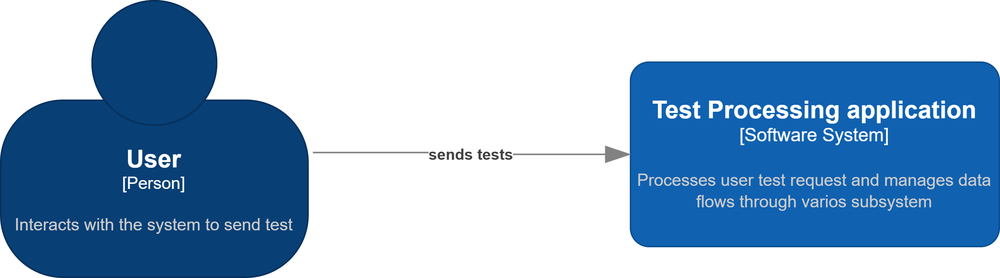
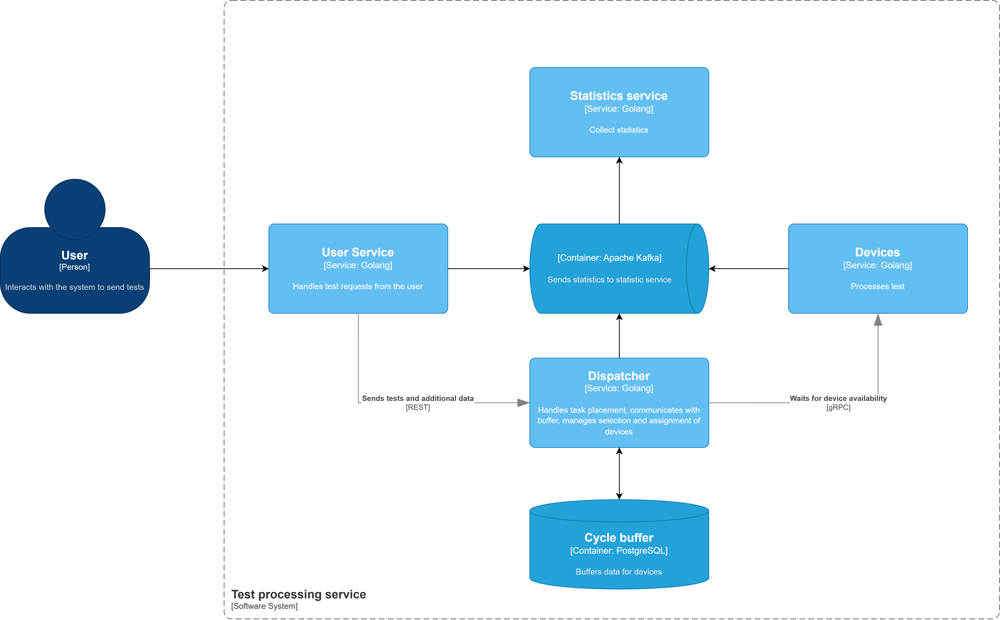
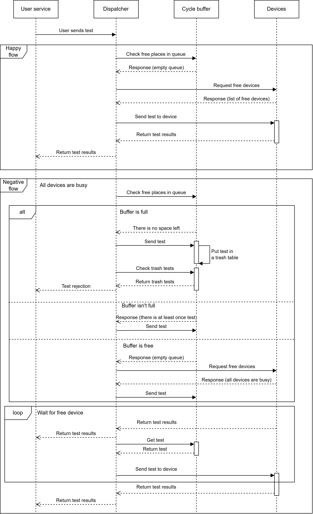
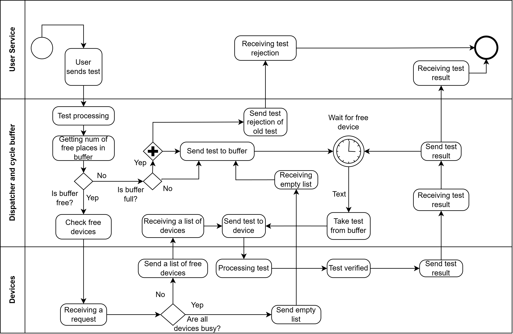

# Architecture-of-program-system
## Расшифровка требований к работе
1. **Параметры элементов модели**:
    1. Источники:
        1. БИ - бесконечный источник
        2. Закон распределения ИЗ1 - пуассоновский
    2. Приборы:
       ПЗ2 - равномерный
2. **Описание дисциплин постановки и выбора**:
    1. Дисциплина буферизации:
       Д10З1 - записи в буфер по кольцу
    2. Дисциплина отказа:
        1. Д10О2 - приоритет по номеру источника (заявка  имеет два параметра - номер источника и время генерации)
    3. Дисциплины постановки на обслуживание:
        1. Д2Б5 - приоритет по номеру источника заявки в пакете (пакет в данном случае - совокупность заявок одного источника, и выбор в бп всегда идет в сторону самого приоритетного источника, и только когда от него все заявки закончатся, то можно приступить к след источникам)
    4. Дисциплины выбора прибора:
        1. Д2П1 - приоритет по номеру прибора
3. **Виды отображения результатов работы программной модели**:
    1. Отражение результатов после сбора статистики:
       ОР1 - сводная таблица результутатов
    2. Отражение динамики функционирования модели
       ОД3 - временные диаграммы, текущее состояние

## Бизнес-домен
Система обработки ошибк в тестах. На онлайн курсе люди проходят тесты и они проходят
обработку (проверку).
В случае если кондидаты будут отправлять много тестов, то будет приосходить выбивание, тех, кто стоит в очереди на проверку

## Маппинг 
1. Источник - пользователи онлайн курса, которые отправляют теста
2. Заявка - запрос на обработку теста
3. Буфер - кольцевая очередь запросов на обработку тестов
4. Прибор - обработчик тестов
5. Диспетчер - система, которая обраобатывает запросы на обработку, а после ставит их в кольцевую очередь, а также которая выбирает запрос из буфера и ставит на прибор 

## Артефакты
### C4-context

### C4-container

### Sequence

### BPMN
